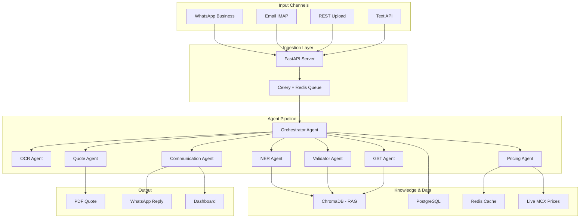
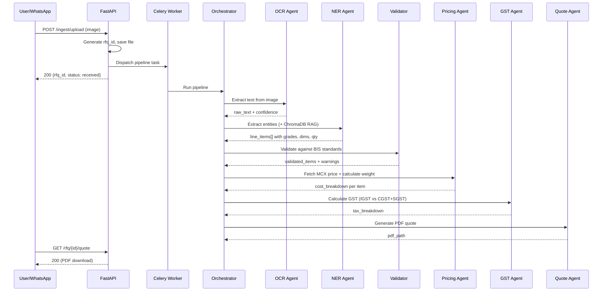
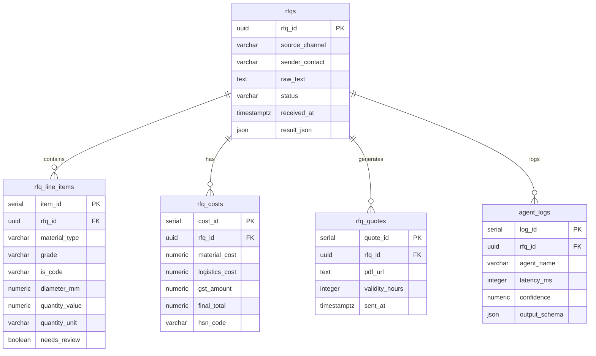

# 🏗️ SRIP — Smart RFQ Intelligence Pipeline

> **AI-powered quotation automation for Indian steel MSMEs.** Converts incoming RFQs (WhatsApp, email, file uploads) into GST-compliant PDF quotations in under 3 minutes using agentic RAG architecture.

[](https://python.org)
[](https://fastapi.tiangolo.com)
[](https://reactjs.org)
[](LICENSE)

---

## 📋 Table of Contents

- [Architecture](#-architecture)
- [Quick Start](#-quick-start)
- [Tech Stack](#-tech-stack)
- [API Reference](#-api-reference)
- [Agent Pipeline](#-agent-pipeline)
- [Sample Walkthrough](#-sample-walkthrough)
- [Database Schema](#-database-schema)
- [Deployment](#-deployment)
- [Security](#-security)

---

## 🏛️ Architecture



### Data Flow



---

## 🚀 Quick Start

### Prerequisites
- Python 3.11+
- Node.js 18+
- Redis (optional — for Celery)
- PostgreSQL (optional — in-memory fallback available)

### 1. Backend Setup

```bash
cd backend
python -m venv .venv
source .venv/bin/activate
pip install -r requirements.txt
cp .env.example .env  # Edit with your API keys
python -m app.main
```

### 2. Frontend Setup

```bash
cd frontend
npm install
npm run dev
```

### 3. Docker (Full Stack)

```bash
docker-compose up --build
# Backend: http://localhost:8000
# Frontend: http://localhost:3000
# Flower:   http://localhost:5555
# API Docs: http://localhost:8000/docs
```

---

## 🔧 Tech Stack

| Layer | Technology |
|-------|-----------|
| **Frontend** | React 18, Vite 5, TailwindCSS 3, Lucide Icons |
| **Backend** | FastAPI, Python 3.11, Pydantic v2 |
| **LLM** | Groq (LLaMA3-70B, Mixtral-8x7B) |
| **OCR** | Tesseract + Groq Vision |
| **Vector DB** | ChromaDB |
| **Database** | PostgreSQL 15 + SQLAlchemy 2.0 |
| **Queue** | Celery 5 + Redis 7 |
| **PDF** | WeasyPrint + Jinja2 (ReportLab fallback) |
| **Messaging** | Twilio WhatsApp API |
| **Deployment** | Docker, docker-compose |

---

## 📡 API Reference

### Ingestion

| Method | Endpoint | Description |
|--------|----------|-------------|
| `POST` | `/api/v1/ingest/upload` | Upload RFQ file (PDF, image, docx) |
| `POST` | `/api/v1/ingest/text` | Submit raw text RFQ |
| `POST` | `/api/v1/webhook/whatsapp` | Twilio WhatsApp webhook |

### RFQ Management

| Method | Endpoint | Description |
|--------|----------|-------------|
| `GET` | `/api/v1/rfq/feed` | List all RFQs (dashboard feed) |
| `GET` | `/api/v1/rfq/{id}` | Get full RFQ details + results |
| `GET` | `/api/v1/rfq/{id}/status` | Get processing status only |
| `GET` | `/api/v1/rfq/{id}/quote` | Download generated PDF quote |

### Auth

| Method | Endpoint | Description |
|--------|----------|-------------|
| `POST` | `/api/v1/auth/login` | Get JWT token |
| `GET` | `/api/v1/auth/me` | Current user info |

---

## 🤖 Agent Pipeline

| # | Agent | Model | Role | RAG Source |
|---|-------|-------|------|-----------|
| 0 | **Orchestrator** | LLaMA3-70B | Task planning + dispatch | Agent capabilities |
| 1 | **OCR** | Groq Vision / Tesseract | Image → text | — |
| 2 | **NER** | LLaMA3-70B | Entity extraction | IS codes, synonyms |
| 3 | **Validator** | Rule engine | BIS standards validation | IS code lookup |
| 4 | **Pricing** | Mixtral-8x7B | Weight + cost calculation | MCX prices (Serper) |
| 5 | **GST** | Rule engine | Tax jurisdiction + HSN | HSN/GST rules |
| 6 | **Quote** | LLaMA3-70B | PDF generation | Templates |
| 7 | **Communication** | LLaMA3-8B | WhatsApp/email dispatch | — |

---

## 📝 Sample Walkthrough

### Input (WhatsApp Message)
```
Bhai 12mm sariya Fe500 10 ton chahiye
Delivery: Sachin GIDC, Surat 394230
Urgent
```

### NER Output
```json
{
  "line_items": [{
    "material_type": "TMT_Bar",
    "grade": "Fe 500",
    "is_code": "IS 1786:2008",
    "dimensions": {"diameter_mm": 12, "length_ft": 40},
    "quantity": {"value": 10, "unit": "tons"},
    "destination_pincode": "394230",
    "urgency": "immediate"
  }],
  "overall_confidence": 0.92
}
```

### Cost Breakdown
```json
{
  "material_cost": 580000.00,
  "logistics_cost": 16750.00,
  "margin_amount": 29000.00,
  "subtotal": 625750.00,
  "gst": {"type": "CGST+SGST", "amount": 112635.00},
  "grand_total": 738385.00
}
```

---

## 🗄️ Database Schema



---

## 🚢 Deployment

### Docker Compose (Recommended)

```bash
# Development
docker-compose up --build

# Production
docker-compose -f docker-compose.yml -f docker-compose.prod.yml up -d
```

### Scaling Strategy

| Component | Scaling | Method |
|-----------|---------|--------|
| Backend API | Horizontal | Multiple Uvicorn workers behind load balancer |
| Celery Workers | Horizontal | `--concurrency=N` or multiple worker containers |
| PostgreSQL | Vertical + Read replicas | Connection pooling via PgBouncer |
| Redis | Vertical | Redis Cluster for HA |
| Frontend | CDN | Static assets served via CloudFront/Cloudflare |

---

## 🔒 Security

- **JWT Authentication** with role-based access (admin, operator)
- **File upload validation** — size limits, allowed extensions, content-type check
- **Path traversal prevention** — sanitized filenames
- **CORS** — configurable allowed origins
- **API rate limiting** ready (middleware prepared)
- **Request ID tracing** — every request gets a unique ID
- **Audit logging** — agent execution logged with timing + confidence
- **Secrets management** — `.env` file, never committed to git

---

## 📄 License

MIT — See [LICENSE](LICENSE) for details.